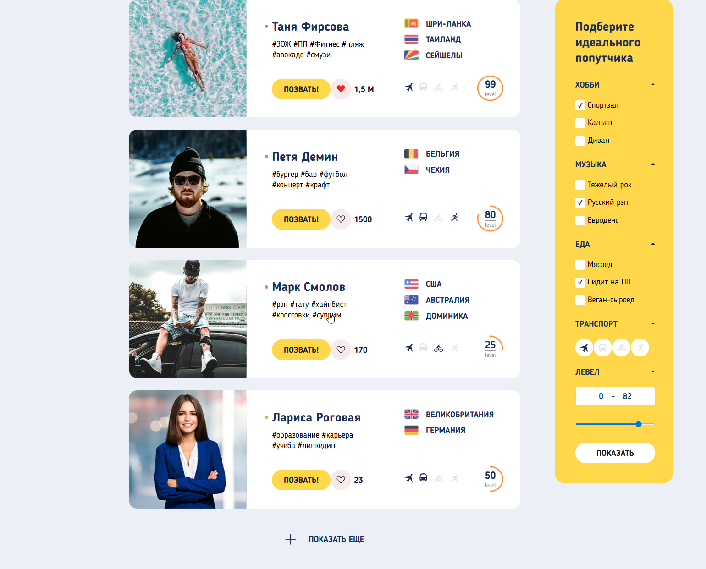

# Fellow Travelers
Веб-интерфейс для поиска попутчиков на основе общих интересов, желаемых направлений и стиля путешествий.



## Описание

Fellow Travelers — фронтенд-проект, представляющий карточный каталог профилей путешественников. Каждая карточка содержит фото, имя пользователя, уровень опыта, желаемые направления, предпочтительный транспорт и теги интересов. Фильтрация по хобби, музыкальным вкусам, предпочтениям в еде, транспорту и уровню опыта позволяет найти подходящего попутчика.

## Функциональность

- Карточки профилей с онлайн-статусом, лайками, тегами и информацией о направлениях
- Панель фильтров по хобби, музыке, еде, транспорту и уровню опыта
- Пагинация с кнопкой "показать ещё"
- Адаптивная вёрстка на SCSS

## Технологии

- HTML, SCSS, JavaScript
- Gulp 4 — сборка проекта: компиляция SCSS, автопрефиксер, минификация CSS, HTML-инклуды, оптимизация изображений, конвертация в WebP, живая перезагрузка
- Webpack через `webpack-stream` — бандлинг JavaScript
- Babel с `@babel/preset-env` — транспиляция
- Browserslist — поддержка последних 5 версий браузеров

## Структура проекта

```
fellow-travelers/
├── src/           # Исходные файлы (HTML, SCSS, JS, изображения)
├── build/         # Скомпилированные файлы
├── docs/          # Сборка для GitHub Pages
├── gulp/          # Модули Gulp-задач
├── gulpfile.js    # Конфигурация Gulp
├── webpack.config.js
└── package.json
```

## Запуск

**Требования:** Node.js и npm

**Установка зависимостей:**

```bash
npm install
```

**Запуск dev-сервера с живой перезагрузкой:**

```bash
npx gulp
```

**Сборка для продакшена:**

```bash
npx gulp docs
```

Продакшен-сборка выводится в папку `docs/`, которая используется для деплоя на GitHub Pages.
